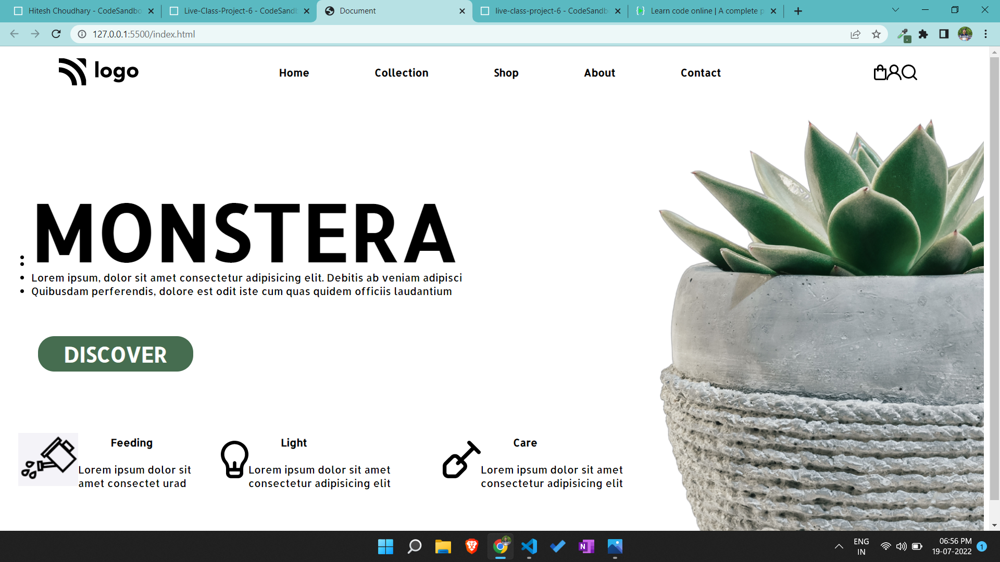

# Portfolio project 6

This is a one page portfolio template project made in HTML and CSS.

# Project live link

[Portfolio-project-6](https://glistening-taiyaki-7b4b21.netlify.app)

# Screenshot

# My learnings from this projects

- I learned how to use icons.
- I learned how to make cards.

# Time to finish the projecet

I took about 2 hours approximately to complete this project.
